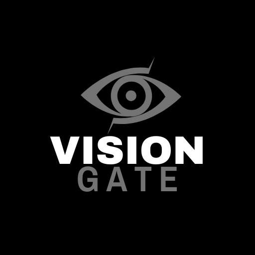
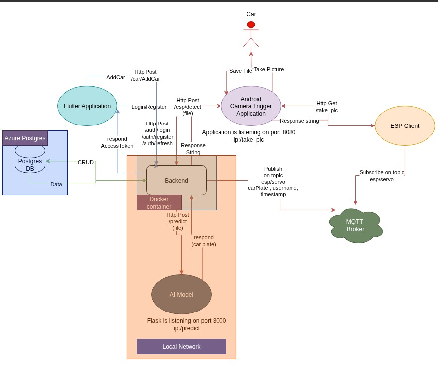
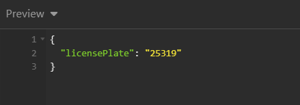
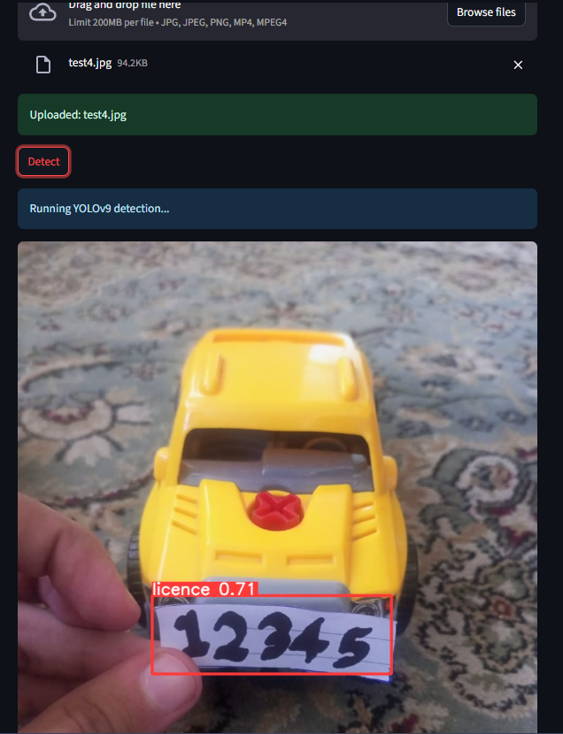
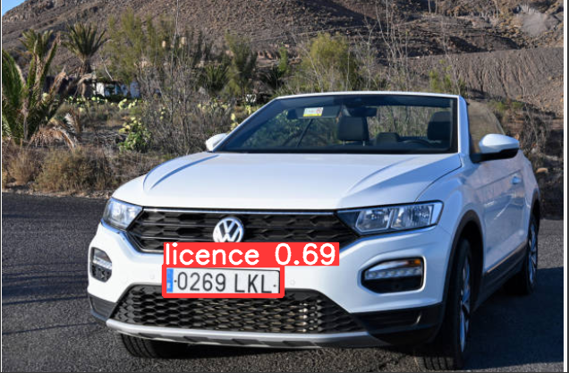

# VISION Gate – End-to-End IoT & AI Smart Parking Solution  

  

---

## Overview  
VISION Gate is a **smart parking system** where users register via the mobile app.  
When approaching the garage, the **camera scans the license plate** and checks it against the system for **secure, automated entry**.  

---

## System Architecture  

  

  

### Upcoming System Update (Expected)

  

---

## Backend & Hardware  

- **NestJS Backend** with clean software architecture.  
- **AI Model Integration** for license plate detection.  
- **Flutter Mobile Application** for user interaction.  
- **ESP32 Firmware** to manage sensors, servos, and LEDs.  
- **MQTT-based real-time communication** between backend, ESP32, and mobile app.  
- **Custom camera detection app** integrated with backend APIs.  
- **Dockerized backend**, deployed on Azure Container Service with remote operation.  

Backend on Azure:  

  

---

## Wiring & Electronics  

**Designed and connected circuits with sensors and actuators.**  

### Components Used:
- **LDR (Light Dependent Resistor):** light sensing  
-  **IR Sensor:** object detection  
-  **Buzzer:** alerts/notifications  
-  **Servo Motor:** mechanical movement (garage gate control)  
-  **LCD:** status messages  
-  **LEDs (x3):** system feedback indicators  

Circuit Prototype:  

  

---

##  IoT & Communication  

- Integrated **MQTT** for real-time communication.  
- Implemented **API Client** for RESTful interaction with backend.  
- Achieved seamless communication between **ESP32 → Backend → Mobile App**.  

---

##  Software & Architecture  

- Developed with **Platform IO**, structured in modules (peripherals as classes).  
- **Dependency Injection (DI):** for flexibility and testability.  
- **Single Responsibility Principle (SRP):** each module has one job.  
- Produced **clean, maintainable, reusable code**.  

API & Communication Demo:  

  

---

##  Database Design  

📌 Organized into **Schemas** for clarity and separation of concerns.  

- **Users Table** → first_name, last_name, address, phone, DOB, user_id, email, image_link, password  
- **Cars Table** → car_id, company, car_model, user_id, plan_id, subscription_start  
- **Plans Table** → plan_id, value, unit, price  

 Database Diagrams:  

  

  

  

---

##  AI Model  

**Objectives:**  
- Detect license plates from images.  
- Extract plate numbers as text.  
- Provide API for integration.  

**Tools & Tech:**  
-  YOLO → plate detection  
-  OpenCV → image preprocessing  
- EasyOCR → text recognition  
-  Flask API → serve predictions  

**Pipeline:**  
1. API receives image  
2. YOLO detects bounding box  
3. OpenCV crops plate  
4. EasyOCR extracts text  
5. Flask returns license number  

 Detection Examples:  

  
  

---

##  Flutter Mobile Application  

- Designed using **FlutterFlow**.  
- **Dark/Light Mode** support starting from login.  
- Built **11 pages** with smooth navigation.  
- Added **animations** to enhance UX.  
- Integrated with backend APIs and tested thoroughly.  

---

##  Testing & Extras  

- Test scripts → [`test.sql`](test.sql)  
- Database dump and migrations included.  

---

##  Summary  

VISION Gate is a **fully integrated IoT + AI + Cloud system**, combining:  
-  IoT firmware (ESP32 + sensors + actuators)  
-  Cloud backend (NestJS, Docker, Azure)  
-  AI-driven detection (YOLO + OpenCV + EasyOCR)  
-  Mobile App (Flutter)  

A **real-world, production-ready smart parking solution**.  

---
